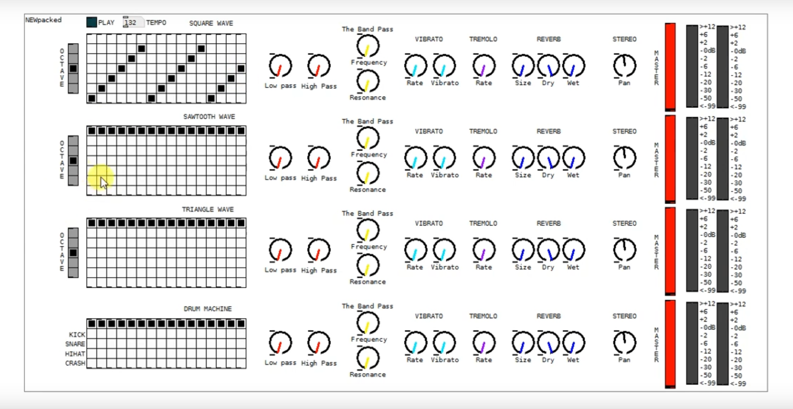

# 8-Bit-Tron
 8-Bit-Tron is virtual Chromatic Instrument sequencer. The prototype was 
created with Pure Data visual Programming language.

The sequencer has sixteen note patterns for four different sound generators. 
Three of the sound generators are digital sound waves (Triangle, Sawtooth and Square). 
Additionally there are affects made such as reverb, distortion and EQ effects.

# Instructions
In order to try out the program you need to have Pure Data installed on your 
system and launch The 8 Bit Tron (MAIN PATCH).pd

# Video
Video example of the instrument: 
https://www.youtube.com/watch?v=OAt2bsDDgok
